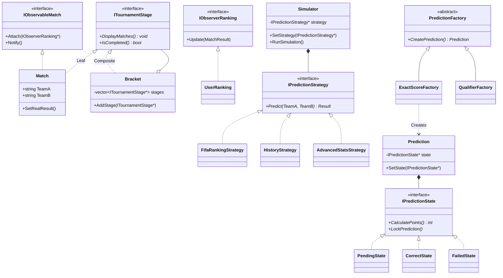

# 🏆 Simulador y Predictor del Mundial (Quiniela C++)

Un sistema de simulación y predicción de resultados para la Copa del Mundo, construido en **C++**. Este proyecto es una demostración práctica de la aplicación de **Patrones de Diseño** (GoF) para estructurar el código de manera limpia, escalable y mantenible. Gestiona desde la complejidad de los algoritmos de predicción hasta la actualización dinámica de los puntajes de los usuarios.

---

## 🛠️ Tecnologías

* **Lenguaje:** C++ (C++17 / C++20 recomendado)
* **Build System:** CMake / Make
* **Paradigma:** Programación Orientada a Objetos (POO)

---

## 🏗️ Patrones de Diseño Implementados

El sistema utiliza punteros inteligentes (`std::shared_ptr`, `std::unique_ptr`) para un manejo seguro de la memoria en la implementación de los siguientes patrones:

### 1. Strategy (Comportamiento)

**Uso:** Definir y encapsular distintos algoritmos para predecir el resultado de un partido.

* **Implementación en C++:** Se define una clase abstracta pura `IPredictionStrategy` con un método virtual puro `Predict()`. Las clases concretas (`FifaRankingStrategy`, `HistoryStrategy`, `AdvancedStatsStrategy`) heredan de ella. El sistema utiliza polimorfismo para inyectar el algoritmo deseado en el simulador mediante un puntero, permitiendo cambiar la estrategia en tiempo de ejecución.

### 2. Observer (Comportamiento)

**Uso:** Actualizar dinámicamente el ranking de la quiniela cuando un partido real termina.

* **Implementación en C++:** La clase `Match` actúa como *Subject* (Sujeto observable) y mantiene un `std::vector<std::shared_ptr<IObserver>>`. La clase `UserRanking` actúa como *Observer*. Cuando se llama al método `SetRealResult()` en un partido, este itera sobre sus observadores llamando al método `Update()`, permitiendo que los usuarios recalculen sus puntos automáticamente.

### 3. Factory Method (Creacional)

**Uso:** Crear diferentes tipos de apuestas de forma desacoplada.

* **Implementación en C++:** Una clase base `PredictionFactory` expone el método virtual `std::unique_ptr<Prediction> CreatePrediction()`. Subclases como `ExactScoreFactory`, `TopScorerFactory` y `QualifierFactory` sobreescriben este método para instanciar y retornar los objetos específicos (`ExactResult`, `TopScorerBet`), evitando el uso directo del operador `new` en la lógica de negocio principal.

### 4. Composite (Estructural)

**Uso:** Modelar el "bracket" (llaves) del torneo como una estructura de árbol, donde grupos y partidos se tratan de manera uniforme.

* **Implementación en C++:** Se define una interfaz `ITournamentStage` (Componente). La clase `Match` es la *Hoja* (Leaf), ya que no contiene sub-elementos. La clase `Bracket` (o `Group`) es el *Composite*, que almacena un `std::vector<std::shared_ptr<ITournamentStage>>`. Al invocar un método como `DisplayMatches()` en la raíz del torneo, la llamada se propaga recursivamente por todas las fases y partidos.

### 5. State (Comportamiento)

**Uso:** Manejar el ciclo de vida de una predicción/apuesta hecha por un usuario.

* **Implementación en C++:** La clase `Prediction` (Contexto) delega su comportamiento a un objeto que implementa `IPredictionState`. Los estados concretos (`PendingState`, `CorrectState`, `FailedState`) dictan si una apuesta puede ser modificada o cómo calcula sus puntos. Las transiciones de estado actualizan el puntero `std::unique_ptr<IPredictionState>` dentro del contexto.

---

## 📊 Diagrama de Clases (Arquitectura)



---

## 🚀 Cómo compilar y ejecutar el proyecto

Este proyecto utiliza `CMake` para facilitar la configuración de compilación multiplataforma.

1. **Clonar el repositorio:**
```bash
git clone https://github.com/tu-usuario/quiniela-patrones-cpp.git
cd quiniela-patrones-cpp

```


2. **Crear el directorio de compilación (Build):**
```bash
mkdir build && cd build

```


3. **Configurar el proyecto con CMake:**
```bash
cmake ..

```


4. **Compilar el código fuente:**
```bash
cmake --build .

```


*(Alternativamente, si estás en Linux/macOS y usaste generadores Makefiles, puedes ejecutar simplemente `make`).*
5. **Ejecutar el simulador:**
```bash
./QuinielaSimulator

```


*(Nota: El nombre del ejecutable final puede variar dependiendo de la configuración en tu archivo `CMakeLists.txt`).*
