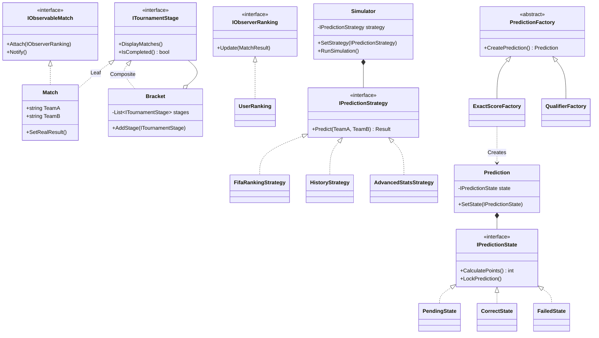

# 🏆 Simulador y Predictor del Mundial (Quiniela .NET)

Un sistema de simulación y predicción de resultados para la Copa del Mundo, construido en **.NET**. Este proyecto aplica principios de diseño de software limpio utilizando múltiples **Patrones de Diseño** para gestionar la complejidad de las apuestas, los algoritmos de simulación, la estructura del torneo y la actualización en tiempo real de los rankings de los usuarios.

---

## 🛠️ Tecnologías

* **Lenguaje:** C#
* **Framework:** .NET (Core / 8.0+)
* **Paradigma:** Programación Orientada a Objetos (POO)

---

## 🏗️ Patrones de Diseño Implementados

Este proyecto es un caso de estudio ideal para la implementación práctica de patrones de diseño del *Gang of Four (GoF)*. A continuación se detalla cómo se aplica cada uno:

### 1. Strategy (Comportamiento)

**Uso:** Definir distintos algoritmos de predicción para simular quién ganará un partido.

* **Implementación:** Se define una interfaz `IPredictionStrategy`. Las clases concretas (`FifaRankingStrategy`, `HistoryStrategy`, `AdvancedStatsStrategy`) implementan esta interfaz. El sistema puede intercambiar el algoritmo de predicción en tiempo de ejecución según la preferencia del usuario o la configuración del simulador, sin alterar la clase principal del partido.

### 2. Observer (Comportamiento)

**Uso:** Actualizar dinámicamente el ranking de los usuarios cada vez que se carga el resultado real de un partido.

* **Implementación:** El `Match` (Partido) actúa como el *Sujeto* (Subject). Los `UserRankings` (o los perfiles de usuario) actúan como *Observadores*. Cuando un partido finaliza y se establece su resultado oficial, notifica automáticamente a todos los observadores suscritos para que recalculen sus puntajes en la quiniela.

### 3. Factory Method (Creacional)

**Uso:** Generar distintos tipos de apuestas y predicciones sin acoplar el código a las clases concretas.

* **Implementación:** Una clase abstracta `PredictionFactory` define el método de creación. Las subclases (ej. `ExactScoreFactory`, `TopScorerFactory`, `QualifierFactory`) se encargan de instanciar las predicciones correspondientes (`ResultadoExacto`, `Goleador`, `Clasificados`).

### 4. Composite (Estructural)

**Uso:** Modelar la estructura de partidos anidados del torneo (Bracket) tratando grupos e instancias individuales de manera uniforme.

* **Implementación:** Se crea una interfaz `ITournamentStage`. La clase `Match` (Partido individual) actúa como la *Hoja* (Leaf). La clase `Bracket` o `Group` actúa como el *Composite*, conteniendo una lista de `ITournamentStage` (que pueden ser partidos u otras sub-fases como "Fase de Grupos", "Octavos", "Cuartos"). Esto permite calcular estadísticas o verificar el progreso de todo un grupo o del torneo entero con un solo llamado recursivo.

### 5. State (Comportamiento)

**Uso:** Controlar el ciclo de vida y las reglas de validación de cada predicción realizada por un usuario.

* **Implementación:** Una clase `Prediction` mantiene una referencia a una interfaz `IPredictionState`. Los estados concretos son `PendingState` (Pendiente), `CorrectState` (Acertada) y `FailedState` (Fallada). Las acciones (como calcular los puntos o intentar modificar la apuesta) varían dependiendo del estado actual de la predicción (ej. no se puede editar una apuesta si ya pasó al estado Acertada o Fallada).

---

## 📊 Diagrama de Clases (Arquitectura Principal)

A continuación se presenta un diagrama conceptual (generado en Mermaid) que ilustra la relación de los patrones dentro del sistema:



---

## 🚀 Cómo ejecutar el proyecto

1. Clonar el repositorio:
```bash
git clone https://github.com/tu-usuario/quiniela-patrones-dotnet.git

```


2. Navegar al directorio del proyecto:
```bash
cd quiniela-patrones-dotnet

```


3. Compilar el proyecto:
```bash
dotnet build

```


4. Ejecutar la consola/simulador:
```bash
dotnet run

```
